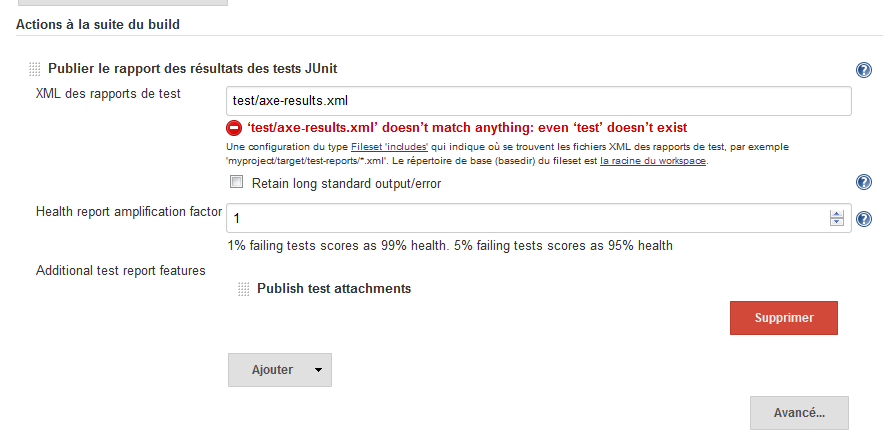
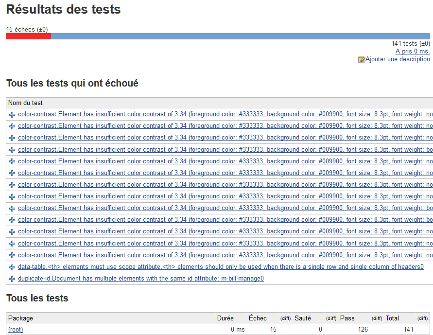
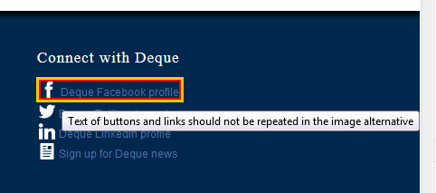

# CasperJS README #

This example demonstrates how to use aXe with CasperJS, save the source code, convert results to JUnit.

## To configure the example ##

* PhantomJS must be installed; please follow the directions at http://phantomjs.org/
  to install it.
* CasperJS must be installed; please follow the directions at http://casperjs.org/
  to install it.
* Run `npm install axe-core`

## To run the example ##

* Move to the `doc/examples/phantomjs` directory
* `phantomjs axe-casper.js http://www.deque.com results/` to run aXe in CasperJS
  against http://www.deque.com and save results to results/axe_results.json and results/axe_results.xml
* Publish axe_results.xml and the source folder results/resources to JUnit on Jenkins for example, will present the result. For each error, a link propose to see the error into the page. The item concerned by the error is outlined in red, and the error message is shown on mouse over.

## Plublish the result in Jenkins ##
* Use the plugin Junit https://wiki.jenkins-ci.org/display/JENKINS/JUnit+Plugin and Junit Attachments https://wiki.jenkins-ci.org/display/JENKINS/JUnit+Attachments+Plugin

* Activate it for your project

* After the second build, you can see a graph onto your project home page

* For each buil you can access to the detailed error list

* For each failure, you can access to the tested page in standalone, with the error element red bordered, when mouseover it, the error message is displayed

## Licence ##

* XML.ObjTree 
Yusuke Kawasaki http://www.kawa.net/

COPYRIGHT AND LICENSE

Copyright (c) 2005-2006 Yusuke Kawasaki. All rights reserved.
This program is free software; you can redistribute it and/or
modify it under the Artistic license. Or whatever license I choose,
which I will do instead of keeping this documentation like it is.

* capturePage function and associated methods Original came from stackoverflow.com
published by artjom-b http://stackoverflow.com/users/1816580/artjom-b
Onto the original question : http://stackoverflow.com/questions/24582307/how-to-save-the-current-webpage-with-casperjs-phantomjs
Under license CC-BY-SA https://creativecommons.org/licenses/by-sa/3.0/

* Other parts of this sample are under the aXe-core license Mozilla Public License, version 2.0